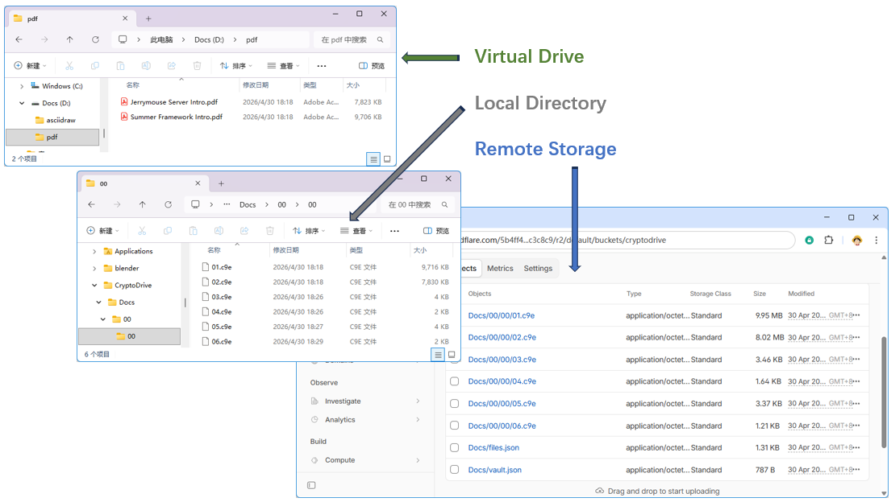

# CryptoDrive

**CryptoDrive** turns any folder on your computer into a password-protected vault
that appears as a regular drive in your file manager. Everything you save into it
is transparently encrypted before it touches disk — drag, drop, edit, and open
files like usual, while only ciphertext ever leaves your machine.

## Download

Pre-compiled release can be downloaded from [GitHub](https://github.com/michaelliao/cryptodrive/releases/latest). Source code can also be get from [GitHub](https://github.com/michaelliao/cryptodrive).

## Features

### Virtual encrypted drive

Unlock a vault with your master password and CryptoDrive mounts it as a native
drive (for example `X:\` on Windows, `/Volumes/MyVault` on macOS, a mount point
on Linux). Any application — editors, IDEs, media players, backup tools — can
read and write files through the drive with zero awareness that the storage is
encrypted.

### Strong, modern cryptography

- **AES-256-GCM** authenticated encryption for every file.
- **PBKDF2-HMAC-SHA256** (1 000 000 iterations by default) derives the key
  encryption key from your master password.
- A unique random **DEK** (Data Encryption Key) per vault and a unique random
  **FEK** (File Encryption Key) per file — compromising one file never exposes
  another.
- Your master password and unwrapped keys live only in memory while the vault
  is unlocked and are zeroized on lock or exit.

### Cloud-sync friendly

Vault directories contain nothing but ciphertext blobs and a small metadata
file. Point Dropbox, Google Drive, OneDrive, iCloud, or any S3-compatible
bucket at the vault folder and sync without ever uploading plaintext. Built-in
connectors for any S3-compatible are included.

### Encrypted file names and folder structure

Not just file contents — file names and the directory tree itself are encrypted
and held in a single metadata file. A snooper who gains access to the
ciphertext directory sees only opaque blob names like `0f/65/6a.c9e`.

### Multi-vault management

Manage as many vaults as you like from one tray-resident app. Each vault has
its own password, its own mount point, and its own optional cloud sync target.
Unlock, lock, import, and configure vaults from the main window.

### Single-instance, tray-resident

Launching CryptoDrive a second time activates the existing window instead of
starting a duplicate. The app lives quietly in the system tray after you close
the main window, keeping your unlocked vaults mounted until you explicitly
lock them or quit.

### Crash- and sync-safe on-disk format

Files are encrypted in fixed 32 KiB blocks, each with its own IV and GCM tag.
A partial write or a sync conflict damages only the affected block — the rest
of the file still decrypts and verifies. Any orphaned ciphertext blob (for
example, one that arrived via cloud sync before its metadata entry) is
surfaced automatically in a virtual `lost+found` directory so you never lose
access to recoverable data.

### Cross-platform

Packaged as a native app image per platform (Windows, macOS Intel, macOS Apple
Silicon, Linux x86-64) with its own bundled Java runtime. Install it and run —
no separate JDK required.

## How it works at a glance

1. **Create a vault** — pick a folder and a master password. CryptoDrive
   generates a random DEK, wraps it with a key derived from your password, and
   writes `vault.json` alongside your chosen folder.
2. **Unlock** — enter your password. The DEK is unwrapped into memory and the
   vault is mounted as a drive.
3. **Use it** — every read and write through the mounted drive is encrypted or
   decrypted on the fly using the per-file FEK (itself wrapped by the DEK).
4. **Lock** — on demand, at shutdown, or when you quit. The drive is
   unmounted, the DEK is zeroized, and only ciphertext remains on disk.

See the [Guide](/guide) to get started, the [Security](/security) page for
the full threat model and crypto details, and the [Sync](/sync) page to wire
up cloud backup.
